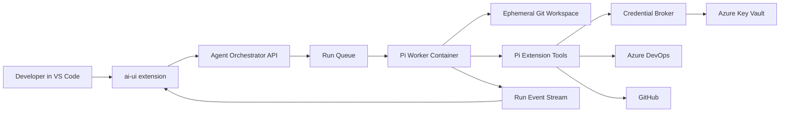

# Pi Coding Agent Integration Exploration

## Goal

Use the Pi coding agent as a headless implementation worker that can take an
Azure DevOps story plus a GitHub repository, make code changes in an isolated
workspace, and expose enough live state that a developer can monitor and steer
the run from `ai-ui` in VS Code.

The important boundary: `ai-ui` remains the developer-facing monitoring and
control surface. Pi runs either locally in a container for development/testing
or in Azure as a managed worker for cloud execution.

## Relevant Pi Capabilities

The Pi package at `packages/coding-agent` is a good fit because it is not only a
terminal UI. It exposes several integration seams:

- CLI interactive mode for local manual use.
- Print/JSON modes for one-shot or event-oriented automation.
- RPC mode over JSONL for process integration.
- SDK entry points such as `createAgentSession(...)` and
  `createAgentSessionRuntime(...)` for embedding Pi inside a Node service.
- TypeScript extensions that can register tools, commands, event handlers,
  custom UI, model providers, permission gates, and MCP integration.
- Session files that preserve the conversation/tool-call tree for replay and
  debugging.

For Azure hosting, the SDK path should be the default. RPC mode is useful as a
fallback when process isolation is more important than tight integration, but an
SDK-hosted worker gives cleaner auth injection, structured event streaming,
approval gates, and operational telemetry.

## Proposed Runtime Shape



### Local Development

- Run the same worker image with Docker or Dev Containers.
- Mount a local scratch directory for cloned repositories.
- Use local environment variables or an Azurite/test Key Vault substitute for
  non-production credentials.
- Allow a developer to run Pi directly for debugging, but exercise the normal
  orchestrator path for integration tests.

### Azure Hosting

- Host the orchestrator API as Azure Container Apps or App Service.
- Run Pi workers as Container Apps jobs, AKS jobs, or Azure Batch jobs depending
  on required isolation and concurrency.
- Use one run per container or one run per isolated workspace. Prefer one run
  per container for stronger cleanup guarantees.
- Give the worker a managed identity that can read only the Key Vault secrets it
  is authorized to request through the broker path.
- Store run metadata and append-only event logs in durable storage, for example
  Cosmos DB, PostgreSQL, or Azure Table/Blob Storage.

## Plugging In Existing ADO and GitHub Agents

The ADO and GitHub agents should be exposed to Pi as first-class Pi extension
tools rather than as raw network access from the model.

Recommended package shape:

```text
pi-agent-package/
  package.json              # pi manifest points to extensions/ and skills/
  extensions/
    ado-tools.ts            # get story, update story, add comment, etc.
    github-tools.ts         # clone/branch/commit/PR/status tools
    credential-context.ts   # resolves credential handles, never PATs to model
  skills/
    implement-ado-story/
      SKILL.md              # workflow: read story, inspect repo, edit, test, PR
```

Each tool should accept business inputs (`storyId`, `repo`, `branchName`,
`comment`) plus a run-scoped credential handle injected by the worker runtime.
The model should never choose a token, secret name, vault URI, or arbitrary API
URL.

If the existing agents are MCP servers, there are two practical options:

- Wrap each MCP operation as a Pi extension tool. This is the simplest and most
  inspectable path.
- Add an MCP client bridge inside a Pi extension, then expose a curated subset
  of MCP tools. This keeps MCP as an implementation detail while preserving a
  strict allowlist.

## Auth and Credential Delegation

The safest model is not "pass a user token to the agent." It is "pass an
opaque run credential context to trusted tools." Pi and the LLM receive only a
handle; the tool runtime validates that handle and injects credentials into
source-specific API clients outside the model's visibility.

### Preferred Long-Term Path

Use native delegated auth where the source supports it:

- GitHub: prefer a GitHub App or OAuth App with user authorization and
  repository-scoped permissions. For organization automation, GitHub App
  installation tokens are usually better than PATs.
- Azure DevOps: prefer Entra-backed OAuth/OBO if the APIs and MCP server support
  the required operations. If the current ADO MCP server only supports PATs,
  keep PAT use behind the broker until integrated auth is available.
- Azure resources: use managed identity and Azure RBAC. Do not store Azure
  resource credentials for the agent.

### Practical Near-Term Path

Use per-user or per-organization secret escrow in Azure Key Vault, mediated by a
credential broker:

1. The initiating user signs in to the orchestrator with Entra ID.
2. The orchestrator creates a run with `userId`, `tenantId`, `storyId`, `repo`,
   requested scopes, and an expiry.
3. The broker maps that authenticated user and requested source to a specific
   Key Vault secret or native OAuth refresh token.
4. The worker receives a short-lived run credential handle, not the secret.
5. Pi extension tools call the broker with the handle and tool operation.
6. The broker verifies the run, user, repo/story binding, scope, and expiry.
7. The broker either performs the source API call itself or returns a short-lived
   in-memory credential only to the trusted tool adapter.
8. Tool results are redacted before being returned to Pi.

Important constraints:

- Do not place PATs in Pi session files, prompts, tool arguments, logs, or model
  messages.
- Do not let the model request arbitrary secret names.
- Use short-lived handles per run and rotate/revoke underlying PATs.
- Scope PATs as narrowly as the source allows.
- Treat transcript/event logs as sensitive because they may contain code,
  story details, branch names, comments, and tool results.

## Run Lifecycle

1. Developer starts a run from `ai-ui` with an ADO story and GitHub repo.
2. Orchestrator validates the user and creates a run record.
3. Worker starts an isolated container workspace and clones the target repo.
4. Worker starts a Pi SDK session with:
   - project instructions/context files,
   - the implementation skill,
   - ADO/GitHub extension tools,
   - a run-scoped credential context,
   - an event sink.
5. Pi reads the story, inspects the repo, edits files, runs tests, and creates a
   branch/PR when ready.
6. Worker streams events throughout the run.
7. Developer monitors, pauses, steers, approves, or cancels from `ai-ui`.
8. Orchestrator persists artifacts: transcript, tool events, diff summary, test
   output, PR URL, and final status.

## Monitoring With ai-ui

`ai-ui` should grow from a PR-list renderer into a run monitor. The extension
does not need to host Pi locally to be useful; it needs a typed integration with
the orchestrator.

Useful new widgets/tools:

- `show_agent_runs`: table/list of active and recent runs.
- `show_agent_run`: timeline/detail view for a single run.
- `show_agent_diff`: open changed files or native VS Code diffs.
- `send_agent_message`: steer a running agent with an operator note.
- `approve_agent_action`: approve gated operations such as pushing a branch,
  opening a PR, or updating an ADO work item.
- `cancel_agent_run`: stop a run and archive the workspace/logs.

Run timeline events should include:

- user prompt/story loaded,
- model messages,
- tool calls and redacted inputs,
- tool results and status,
- file edits,
- shell commands and exit codes,
- tests/builds,
- approvals requested/granted/denied,
- commits/branches/PRs,
- errors and cancellations.

For live monitoring, prefer Server-Sent Events or WebSockets from the
orchestrator to the VS Code extension. The webview should render from typed
payloads and keep source API calls in the extension/orchestrator, not in the
webview.

## Approval and Safety Gates

Pi intentionally avoids built-in permission popups, so our runtime needs to own
the policy gates:

- Filesystem: restrict writes to the cloned repo/workspace.
- Shell: allow normal build/test commands, block host-sensitive commands, and
  execute inside the container only.
- Network: allow only configured source APIs, package registries if required,
  and model provider endpoints.
- Source control: allow commits locally; require approval before pushing or
  opening/updating PRs unless the run mode explicitly permits it.
- Work items: require approval before changing story state, assignment, or
  comments that mention people.
- Secrets: redact known token patterns and never surface broker responses in
  model-visible text.

## Open Questions

- Which source owns user identity: Entra ID only, GitHub login, ADO identity, or
  a linked-account table?
- Are ADO operations limited to read/story context at first, or can the agent
  update work item state/comments?
- Should GitHub access use GitHub Apps from day one, or start with PAT escrow
  while the implementation flow stabilizes?
- Do we need human approval for every PR creation, or only for protected
  repositories/branches?
- What retention period is acceptable for transcripts and workspaces?
- Should cloud runs support interactive steering in v1, or only observe/cancel?
- What is the minimum isolation boundary: Container Apps job, AKS pod, or a
  stronger sandbox such as per-run VM/microVM?

## Suggested First Slice

Build the smallest end-to-end tracer bullet:

1. Package existing ADO/GitHub agents as Pi extension tools with mocked
   credentials.
2. Run Pi in a local container via the SDK against a disposable test repo.
3. Emit normalized run events to a local file or lightweight HTTP stream.
4. Add `show_agent_run` to `ai-ui` as a timeline widget over that stream.
5. Replace mocked credentials with a local broker facade.
6. Move the same container to Azure Container Apps with Key Vault-backed secret
   lookup and managed identity.

This proves the core loop before committing to the final credential strategy:
story in, repo cloned, code changed, tests run, run visible in `ai-ui`, no PAT
visible to the model.